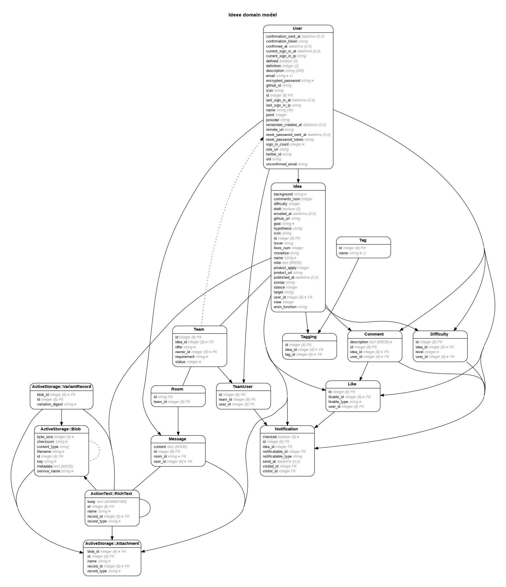

# ideee
アイデアとエンジニアのマッチングプラットフォーム

<!-- TODO Readme書く -->

## アプリURL

https://www.ideee.tech/

## BIツールURL
https://ideee-metabase.herokuapp.com/

## セットアップの情報

全セットアップ方法
https://www.notion.so/ideee/Engineering-Wiki-80fac88f11804c7d86ee1ac06bcfc75f

## versions

- Rails (6.1.4)
- Ruby 3.0.2p107
- mysql2 (0.5.3)

* System dependencies

## ER図の作成方法

`bundle exec erd --attributes=foreign_keys,primary_keys,content --filename=erd_sample --filetype=png`
（dbを修正した場合にコマンドを流す）

# ER図

