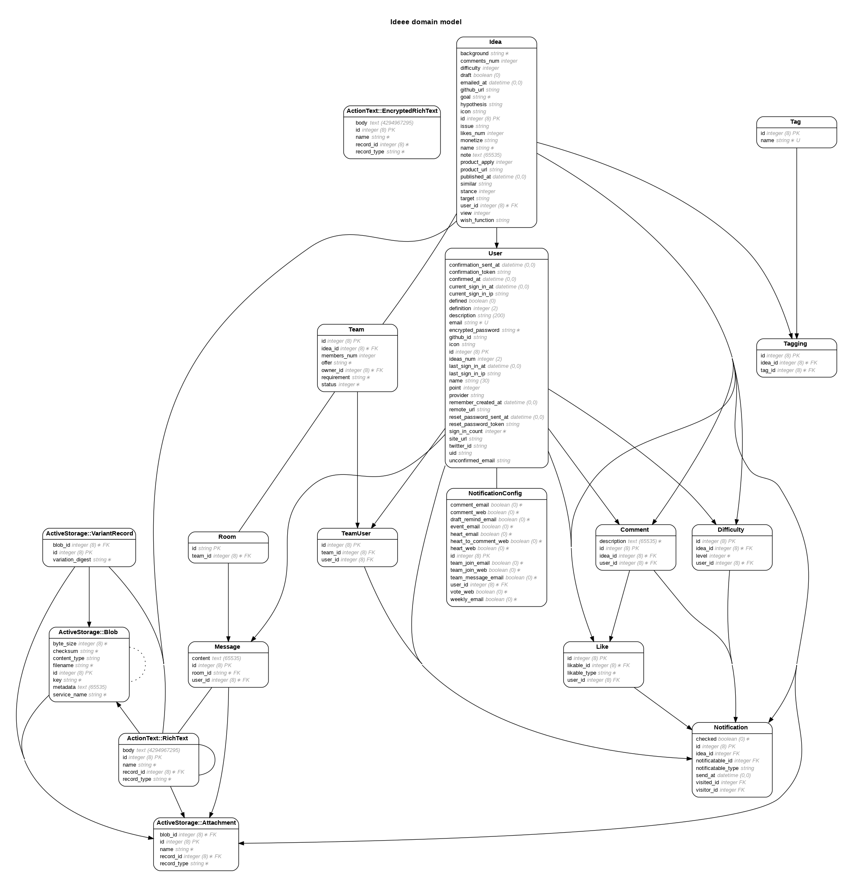

# ideee
アイデアとエンジニアのマッチングプラットフォーム

<!-- TODO Readme書く -->

## セットアップの情報

全セットアップ方法
https://www.notion.so/ideee/Engineering-Wiki-80fac88f11804c7d86ee1ac06bcfc75f

## versions

- Rails (7.0.4)
- Ruby 3.0.2p107
- mysql2 (0.5.3)

* System dependencies

# ER図

`migrate時にER図を自動生成する`

# graphqlの設定

1. graphqlからSchemaダンプを作成

`rake graphql:schema:dump`

